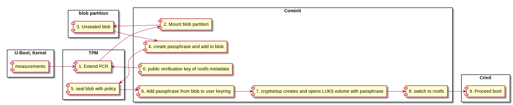
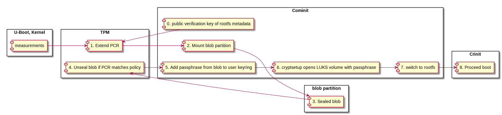

# Measured boot

## cominit features

* extend a given PCR with the public verification key of rootfs metadata
* check signature and sealing. Both checks must succeed to verify secure boot.
* add the passphrase sealed by the TPM to the kernel ring key
* create and open a LUKS volume with the unsealed passphrase on successful    measured boot

## First boot

An overview of the sequence provides the following diagram:

Cominit is extending a PCR register with the checksum of the rootfs metadata.
This PCR register should already be extented by Kernel and other participants of the boot chain that should be measured. The current hash of this PCR or the combination of this PCR and further PCRs should be bound to a policy. Cominit creates a new passphrase for creating a LUKS volume.
With the policy the TPM seals the new created passphrase into an encrypted blob. The blob is stored into a partition previously mounted by cominit.
After adding this passphrase to the user key ring, cominit invokes cryptsetup to create and open a LUKS volume with this passphrase.

## Every boot
An overview of the sequence provides the following diagram:

On every boot Cominit extends the register in the same way as on the very first boot. If the current state of the PCRs matches the policy, the TPM can unseal the blob. For that Cominit needs to mount the partition with the sealed blob previously. After the successfull unsealing the startup can proceed normally by adding the passphrase to the user key ring, open a LUKS volume with cryptsetup and switching to rootfs.

## Build environment

The image should contain a partition that can be mounted in Cominit to store the encrypted blob.

## Detection of first boot

The detection is done by detecting if blob partition is empty or already populated.

## Secure boot

See documentation here [secure boot](doc/secure_boot/secure-boot.md).