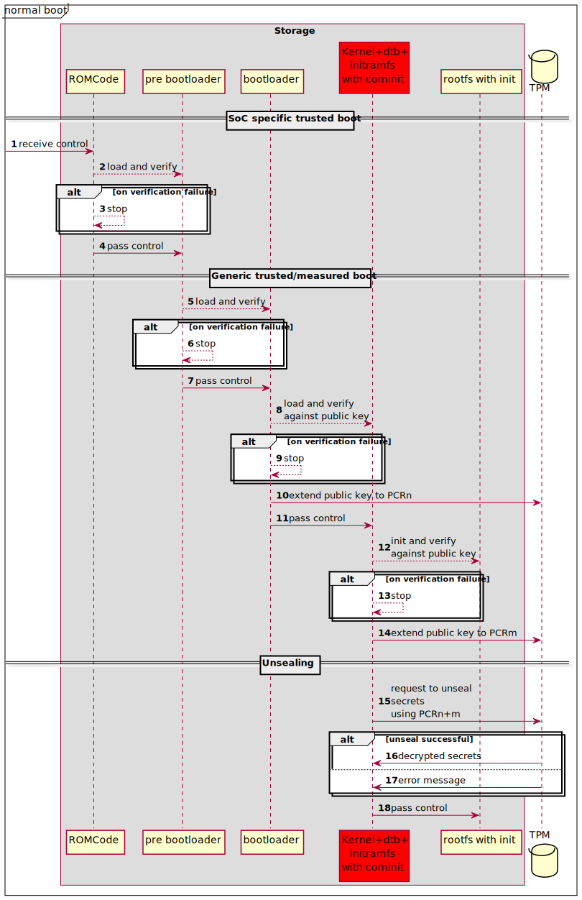
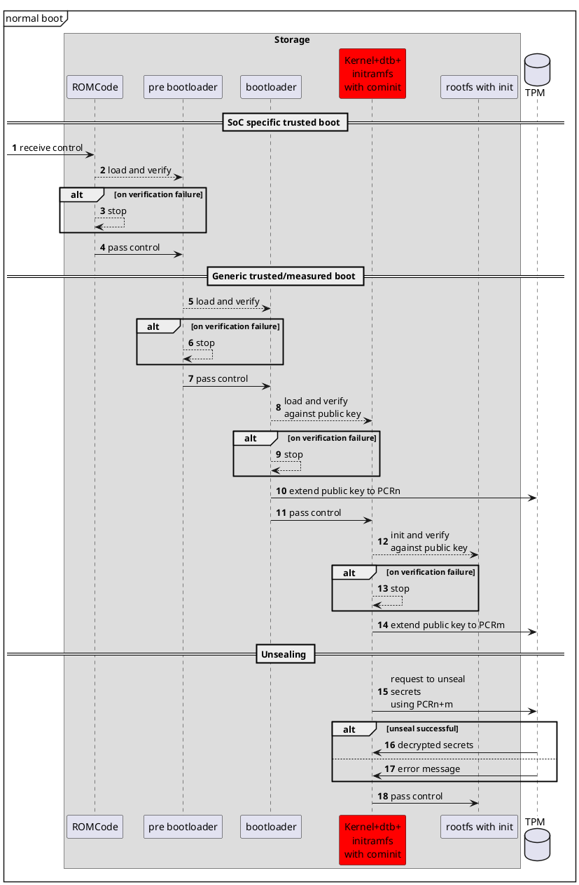

# Secure boot

## basics of trusted boot

Within a secure boot not signed software is prevented to run.

This is achieved by checking each executable **before** passing control to it.

  
PlantUML Code

### Boot Steps

Hints to the above number steps:

**3**: Only accepted pre bootloaders receive control. This is ensured by secure boot measures of the system-on-chip vendors. e.g. HAB by NXP

HENCE: the pre bootloader is trusted software from verified origin

**6**: The pre bootloader passes control only to successfully verified bootloaders

HENCE: the bootloader is trusted software from verified origin

**9**: The bootloader passes control only to successfully verified kernel, dtb and initramfs.

HENCE: the initramfs and this way cominit is trusted software from verified origin

**10**: The public used to verify kernel, dtb and initramfs is extended to PCRn, for later use.

**13**: The cominit of the initramfs only inits the rootfs if successfully verified

HENCE: the rootfs and all containing files and software are trusted software from verified origin

**14**: The public used to verify rootfs is extended to PCRm, for later use.

**15**: The PCRn and PCRm are used to decrypt some secrets.

**16**: If PCRs match expected values the secrets become available

**18**: pass control to rootfs and allow access to secret data if given.

HENCE: only trusted software can handle the secrets

## cominit

Cominit provide secure boot capabilities by:

* checking the signature of the rootfs metadata. (**Step 12**)
* checking whether unsealing of TPM fails (See documentation here [measured boot](doc/measured_boot/measured-boot.md).)(**Step 16**)

If one of this fails, cominit should stop the boot process.
In this state it should **not** enter i.e. a rescue shell in which critical system information can be retrieved.

If unsealing fails, the current PCR values don’t satisfy the policy, so the platform state isn’t trusted. By binding the policy to the appropriate PCRs,  situations as an untrusted kernel or a corrupted initramfs can be detected—because any change extends those PCRs with different hashes.

By doing this checks, Cominit prevents

*  proceeding boot if started from an unknown initramfs
*  running into an unknown kernel

